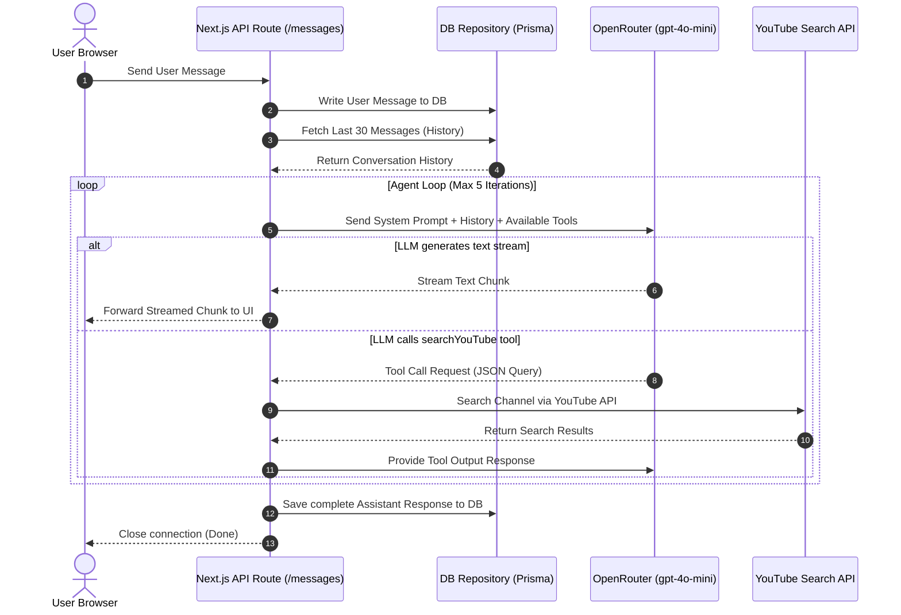

# ☕ Persona AI Chatbot: Hitesh Choudhary & Piyush Garg

An elegant, production-ready AI-powered web application that simulates immersive, style-accurate conversations with two of India's prominent tech educators: **Hitesh Choudhary** (Chai Aur Code) and **Piyush Garg**. 

The chatbot utilizes custom-designed system prompts, real-time context management, and a specialized streaming agent loop with native tool integration to search their respective YouTube channels dynamically for tutorials, code guides, and playlist links.

---

## 🚀 Live Demo & Links

*   **Live Deployed Website:** [https://persona-ai.vercel.app](https://persona-ai.vercel.app) *(Replace with actual URL once deployed)*
*   **GitHub Repository:** [https://github.com/username/persona-ai](https://github.com/username/persona-ai) *(Replace with actual URL)*

---

## ✨ Features

1.  **Immersive Personas:** Highly accurate simulation of Hitesh Choudhary and Piyush Garg's teaching philosophies, speaking styles, and vocabulary.
2.  **Persona Segment Control:** Seamlessly toggle between tutor personas on the empty workspace before starting a chat session.
3.  **Real-Time YouTube Tool Integration:** The agent uses a custom `searchYouTube` function tool to fetch actual, relevant videos and playlists from their YouTube channels rather than hallucinating links.
4.  **Interactive YouTube Cards:** YouTube search results returned as structured JSON are intercepted and rendered as beautiful interactive cards containing hover overlays, thumbnails, play/playlist badges, and description snippets.
5.  **Multi-turn Contextual Memory:** Active context management keeps up to 30 past messages of history synced from a PostgreSQL database using Prisma.
6.  **Secure Authentication:** Built-in Google OAuth support using Better Auth.
7.  **Modern Glassmorphic UI:** A dark-mode first, highly responsive interface with custom theme selectors and clean layout transitions.

---

## 🏗️ System Architecture

The following Mermaid diagram outlines the request-response lifecycle and how the custom agent loop manages user queries, tool executions, and client updates:



---

## 🗃️ Persona Methodology

To recreate authentic, consistent, and educational responses, the personas are modeled based on public content, blogs, talks, and YouTube transcripts:

### 1. Piyush Garg (`piyush`)
*   **Core Philosophy:** First-principles teaching, breaking problems down, logical decomposition, and step-by-step reasoning.
*   **Speech Patterns & Vocabulary:** Structured, analytical, uses terms like *"Let's break this down,"* *"First step,"* *"What we need to understand is,"* *"Step-by-step,"* and maintains a highly direct, logical, and clear tutoring persona.
*   **Implementation Strategy:** Enforces a breakdown of any programming challenge into sub-problems before displaying final solutions.

### 2. Hitesh Choudhary (`hitesh`)
*   **Core Philosophy:** Practical, production-grade architectures, conversational encouragement, real-world folder structures, and direct working code.
*   **Speech Patterns & Vocabulary:** Warm, conversational, enthusiastic, frequently uses signature catchphrases like *"Chai aur code,"* *"Grab a cup of chai,"* *"It's simple/very easy,"* and refers to the user as *"friend"* or *"developers."*
*   **Implementation Strategy:** Instructs the LLM to provide immediate code blocks with comprehensive explanations, performance optimizations, and best practices.

---

## 🧠 Engineering & Implementation

### Prompt Engineering Strategy
The dynamic system prompts are built dynamically inside the [personas.ts](./lib/personas.ts) file using `getSystemPrompt(persona)`. 

*   **System Instructions:** Restricts responses solely to technical and programming topics. Non-tech questions are politely redirected.
*   **YouTube Output Protocol:** Instructs the model to output YouTube search results as a raw JSON array inside a ` ```json ` block. This guarantees structured data delivery to the frontend component [formatted-message.tsx](./components/chat-interface/formatted-message.tsx) for rich cards.

### Context Management
*   **Database Synchronized History:** Messages are written directly to PostgreSQL via Prisma to guarantee persistence across sessions.
*   **Sliding Window Buffer:** The API endpoint [route.ts](./app/api/conversations/[conversationId]/messages/route.ts) fetches only the latest 30 messages (`take: 30`) to serve as the context window. This prevents token bloat and keeps response latency low while preserving rich multi-turn conversation memory.
*   **Streamed Execution:** Using `AsyncGenerator` in [agent.ts](./lib/agent.ts), chunks are yielded to the client in real-time as soon as the LLM outputs them.

---

## 💬 Sample Conversations

### Persona 1: Piyush Garg
> **User:** How do I implement a custom debounce hook in React?
>
> **Piyush Garg:**
> Let's break this problem down into smaller, logical sub-problems to understand how a debounce hook actually works behind the scenes.
> 
> **1. What is the core issue?**
> We want to delay the execution of a function until a certain amount of time has passed since the last time it was called.
> 
> **2. What do we need in React?**
> - A state to track the debounced value.
> - A `useEffect` to set up a timeout timer.
> - A cleanup function inside `useEffect` to clear the previous timer if the input changes before the delay finishes.
>
> Let's write the step-by-step hook:
>
> ```typescript
> import { useState, useEffect } from 'react';
> 
> export function useDebounce<T>(value: T, delay: number): T {
>   const [debouncedValue, setDebouncedValue] = useState<T>(value);
> 
>   useEffect(() => {
>     const handler = setTimeout(() => {
>       setDebouncedValue(value);
>     }, delay);
> 
>     // Cleanup function: clears timeout if value or delay changes
>     return () => {
>       clearTimeout(handler);
>     };
>   }, [value, delay]);
> 
>   return debouncedValue;
> }
> ```
> Let me know if you want to break down how to optimize this with inputs!

### Persona 2: Hitesh Choudhary
> **User:** How do I implement a custom debounce hook in React?
>
> **Hitesh Choudhary:**
> Hello friends, welcome back to Chai aur Code! Let's get code running. 
> 
> Implementing a debounce hook in React is actually very simple and extremely useful for search inputs to save API calls. Grab a cup of chai, and let's write a production-ready hook.
>
> Here is a direct, clean, and working TypeScript implementation:
>
> ```typescript
> import { useState, useEffect } from 'react';
> 
> // Clear, simple type definition for generic values
> export function useDebounce<T>(value: T, delay: number = 500): T {
>   const [debouncedValue, setDebouncedValue] = useState<T>(value);
> 
>   useEffect(() => {
>     const timer = setTimeout(() => {
>       setDebouncedValue(value);
>     }, delay);
> 
>     // Production tip: Always clean up timers to prevent memory leaks!
>     return () => clearTimeout(timer);
>   }, [value, delay]);
> 
>   return debouncedValue;
> }
> ```
> 
> **Why this matters for your architecture:**
> Every time the user types a key, the `useEffect` cleans up the previous timeout. If they pause typing for more than `delay` milliseconds, the state updates and triggers your search request. 
> 
> Simple, clean, and works out of the box. Let me know if you need to fetch some videos on React hooks!

---

## 🛠️ Setup & Local Running

### Prerequisites
*   Node.js 18+ (Bun 1.0+ recommended)
*   A running PostgreSQL instance (or Neon DB connection string)
*   An API key for OpenRouter or OpenAI
*   A Google Cloud Console Project with YouTube Data API v3 enabled

### 1. Clone & Install
```bash
git clone https://github.com/nayalsaurav/persona-ai.git
cd persona-ai
npm install
```

### 2. Configure Environment Variables
Copy `.env.example` to `.env` and fill in your credentials:
```bash
cp .env.example .env
```
Ensure you provide:
*   `DATABASE_URL`: PostgreSQL connection string.
*   `OPENROUTER_API_KEY`: OpenRouter platform key.
*   `YOUTUBE_API_KEY`: Google console YouTube data api key.
*   Better Auth & Google Client credentials for user authentication.

### 3. Setup Database Schema
Generate Prisma client and run migrations:
```bash
# Generate the local client
npx prisma generate

# Apply migrations to database
npx prisma db push
```

### 4. Run Development Server
```bash
npm run dev
```
Open [http://localhost:3000](http://localhost:3000) to view the interface.

---

## 🛡️ License

Distributed under the MIT License. See `LICENSE` for more information.
